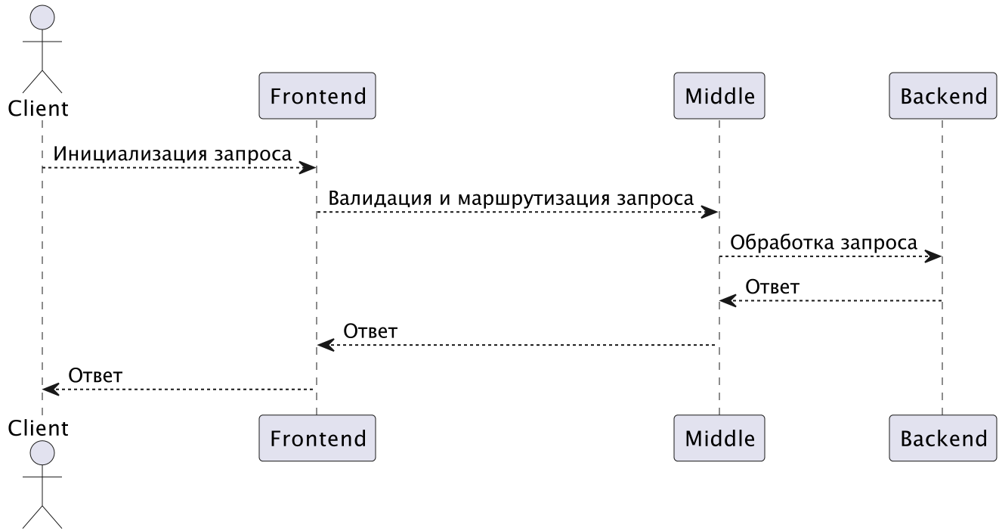

# Telegram бот - банковское приложение
___
**Банковское приложение, созданное на база Telegram бота. Java-сервис будет принимать запросы и осуществлять обработку транзакций, хранение клиентских данных и т.д.**
___
## Quick start
1. Добавить Telegram-bot
2. Нажать /start
---
## Схема работы

___
# Используемые технологии
- frontend (telegram-bot на java/kotlin);
- middle-слой (java/kotlin-сервис);
- backend (java/kotlin-сервис).
